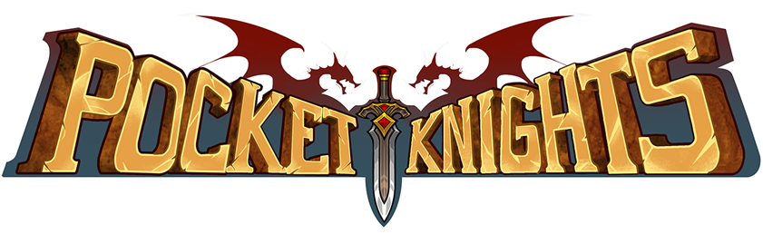
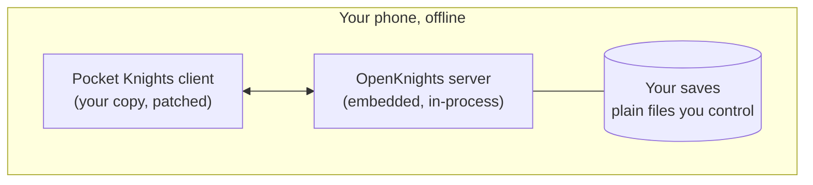

<p align="center">
  
</p>

<h1 align="center">OpenKnights</h1>

<p align="center">
  <strong>Pocket Knights, preserved: fully offline, on your own phone.</strong>
</p>

<p align="center">
  <a href="LICENSE"></a>
  
  
  
  <a href="https://discord.gg/rFBcanFEKh"></a>
</p>

OpenKnights is a preservation project for **Pocket Knights**. A small patcher turns your own copy of the game into a fully offline edition. The game server runs inside the app, so everything works in Airplane Mode: no account, no internet connection, and no root.

> [!IMPORTANT]
> OpenKnights is in development and has no release yet. The first release will be **0.1.0.0**.

---

## Contents

- [What OpenKnights Is](#what-openknights-is)
- [How It Works](#how-it-works)
- [For Players](#for-players)
- [How the Game Was Reconstructed](#how-the-game-was-reconstructed)
- [Repository Layout](#repository-layout)
- [Building From Source](#building-from-source)
- [Documentation](#documentation)
- [Contributing](#contributing)
- [License and Legal](#license-and-legal)

---

## What OpenKnights Is

Pocket Knights is an online game. Its client cannot function without the server it was built to talk to, and that server is gone. OpenKnights brings the game back by reconstructing that server from the game's own observable behavior, then delivering the reconstruction to the player so the game plays again, entirely on the player's device.

Two principles shape everything here:

- **You bring your own game.** The patcher contains no game files. Everything the finished app is built from comes from the copy of Pocket Knights you supply. This repository ships no game code, no game data, and no game art.
- **Exactness, and proof of it.** The reconstruction is not an approximation. For the behavior it covers, it is pinned to the original to the byte, and that claim is tested continuously against a reference implementation. See [How the Game Was Reconstructed](#how-the-game-was-reconstructed).

## How It Works

The player's own game client is patched so that, instead of reaching for the publisher's online services, it talks to an OpenKnights server. That server runs inside the patched app itself, so the whole game is self-contained and offline.



- The **patcher** rewrites the manifest and the sign-in and payment calls, adds the server, and signs the result with a key that is unique to you, so your future updates install cleanly over your own app.
- The **embedded server** speaks the game's own protocol on the device's loopback address, reads the game's data from your APK, and keeps your saves as plain files you can back up, restore, and reset yourself.

## For Players

| Step | What You Do |
| :---: | --- |
| 1 | Download the OpenKnights patcher for Windows or Linux. |
| 2 | Put your own copy of Pocket Knights 4.4.9 in the patcher's `original` folder. |
| 3 | Run the patcher. The finished **OpenKnights** app appears in the `patched` folder. |
| 4 | Install it on your phone or emulator and create your first character. |

Your saves are yours. The app writes backups to a normal folder you can browse and copy, restoring is a matter of opening a backup with the app, and a fresh start is the platform's own clear-data action. No root and no permissions are needed for any of it.

> [!NOTE]
> There is no release yet. These steps describe how the finished patcher will work.

## How the Game Was Reconstructed

Rebuilding a server from a client alone is a reverse-engineering project. The approach is behavior-first and proof-driven:

1. **Observe.** Capture what the game sends, what it receives, and how its saved state changes.
2. **Understand.** Reduce each observation to a rule: a message layout, a data-table meaning, a piece of deterministic math.
3. **Reproduce.** Implement the rule in original code.
4. **Prove.** Replay recorded scenarios against both a private reference implementation and the shipped code, and require every message, every state change, and every random draw to match byte for byte.

The determinism this depends on, the game's random generator, its floating-point rounding, and its use of the device clock, is all reproduced exactly, because a single divergence in a battle or a draw cascades into a different result. The full method, and a system-by-system reference for the game's internals, opcodes, and data files, is in the [wiki](#documentation).

## Repository Layout

The project is a small set of focused modules. The server is split so the same core runs on a PC for development and inside the app on a phone.

| Module | Responsibility |
| --- | --- |
| `exact` | Exactness primitives: deterministic time, entropy, JSON formatting, and the 32-bit float and random-generator models |
| `protocol` | The wire framing and codecs |
| `game-data` | Reading the game's data tables from the player's own APK |
| `server-core` | The reconstruction of the game server: every system, route, and store |
| `server-pc` | Running the server on a PC, and the differential harness |
| `server-android` | Running the server inside the patched app, with the Android storage and transport |
| `patcher-core` | Turning a copy of the game into the OpenKnights app: manifest, code, resources, and signing |
| `patcher-cli` | The command-line patcher |
| `patches/` | The exact edits the patcher applies to the game |
| `wiki/` | The engineering wiki source (see [Documentation](#documentation)) |

## Building From Source

Prerequisites: a JDK, the Android SDK, and the bundled Gradle wrapper.

```bash
# Build everything and run the tests
./gradlew build

# Build the command-line patcher
./gradlew :patcher-cli:installDist
```

Some tests are local-only and are skipped unless the private inputs they need are present; the standard build runs everything that does not require them. The build is verified on Linux and Windows.

## Documentation

The engineering wiki is the reference for how the game works on the inside and how it was reconstructed. It is organized as a reference encyclopedia: each game system has its own page, every network opcode is indexed, and every data file is described by meaning and by its relations to others.

Start with the wiki's **Home** and **System Index**. The source for the wiki lives in [`wiki/`](wiki/), and it is published to this repository's wiki.

> [!IMPORTANT]
> The wiki documents structure, behavior, and method. It never reproduces the game's data, code, or art. See the wiki's **What Is Not In This Repository** page for the boundary that every contributor holds.

## Contributing

Contributions are welcome. Before opening a change, please read the wiki's method and boundary pages so a change respects the exactness discipline and the line on what is never published.

House rules, in brief:

- The exactness discipline is not optional. Behavioral changes are expected to keep the differential harness passing with zero differences.
- Never publish the game's data, code, art, or any redeem code. When in doubt, treat it as private.
- Writing is plain and professional: no emoji and no em-dashes, in code, comments, commits, and docs alike.

## License and Legal

OpenKnights is free software under the [GNU General Public License v3.0](LICENSE).

OpenKnights is an unofficial fan preservation project. It is not affiliated with or endorsed by the developers or publishers of Pocket Knights. Pocket Knights, its logo, and its artwork belong to their respective owners. This project documents behavior and file structure for interoperability and preservation, ships no game content, and requires you to supply your own copy of the game.
