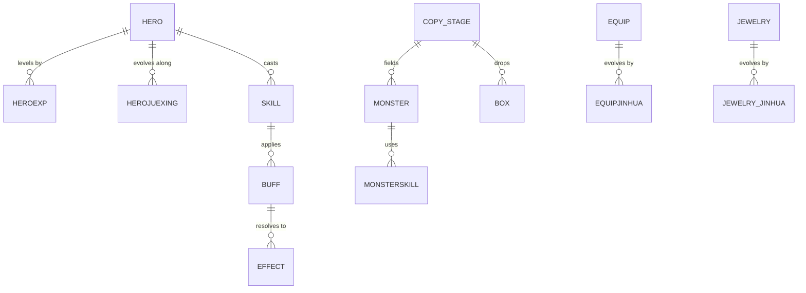

# Data File Index

**Definition.** The catalogue of the game's data tables, grouped by the system that reads them. Each entry describes a table's meaning and its relations to other tables. It never lists the table's contents. See [[What Is Not In This Repository]].

The game ships its balance and content as a large set of tables. There are just under two hundred of them. Their names are romanized from the game's original language, so many read as pinyin. This index records what each table is for and how it connects to the others, which is what a reader needs in order to understand a system. How a table is decoded from the shipped format is covered in [[Method CSV Decryption]].

> The rows of these tables are the publisher's content and are not published here. A data-file page documents columns by name and meaning and the keys that join tables. It does not reproduce values.

## How Tables Relate

Most tables are joined by identifier columns. A stage names a monster group; a monster names its skills; a skill names its effects; a hero names its evolution track. Understanding a system is largely a matter of following these joins. Each data-file page draws the local slice of the relation graph. The shape of the whole graph is sketched below.

## Heroes

| Table | Meaning | Consumed By |
| --- | --- | --- |
| `hero.csv` | The hero roster and base attributes | [[Heroes]] |
| `heroexp.csv` | Hero level experience curve | [[Heroes]] |
| `heromodel.csv` | Hero model bindings | [[Heroes]] |
| `herojuexing.csv`, `herojuexinglv.csv`, `herojuexingneedres.csv`, `herojuexingskill.csv` | Hero evolution tiers, levels, costs, and skills | [[Hero Evolution]] |
| `herorh.csv` | Hero rebirth | [[Rebirth]] |
| `niudanhero.csv`, `xinniudan.csv`, `xinniudan_xunhuan.csv` | Summon hero pools and rotation | [[Summons]] |
| `robot.csv` | Bot roster source | [[World Participants]] |

## Equipment

| Table | Meaning | Consumed By |
| --- | --- | --- |
| `equip.csv`, `equipexp.csv` | Gear roster and experience | [[Gear and Equipment]] |
| `equip_advance.csv`, `equipjinhua.csv`, `equiprh.csv` | Gear advancement, evolution, and rebirth | [[Equipment Evolution]] |
| `jewelry.csv`, `jewelry_exp.csv`, `jewelry_advance.csv`, `jewelry_jinhua.csv`, `jewelry_ronghe.csv` | Jewelry roster, experience, advancement, evolution, and fusion | [[Equipment Evolution]] |
| `baoshi.csv` | Gems | [[Gear and Equipment]] |
| `hecheng.csv`, `equip_hecheng.csv` | Composition recipes | [[Compose]] |

## Combat

| Table | Meaning | Consumed By |
| --- | --- | --- |
| `copy_stage.csv`, `copy_map.csv`, `stage.csv`, `map.csv` | Campaign stages and maps | [[Campaign]] |
| `monster.csv`, `monsterability.csv`, `monsterskill.csv` | Enemy units, abilities, and skills | [[Battle Engine]] |
| `skill.csv`, `buff.csv`, `effect.csv`, `property.csv` | Skills, buffs, effects, and attributes | [[Battle Engine]] |
| `battlesettlement.csv` | Battle settlement rules | [[Battle Report]] |
| `box.csv`, `boxcontrol.csv`, `choosebox.csv`, `starbox.csv` | Reward boxes and choose-boxes | [[Acquisition and Items]] |

## Economy

| Table | Meaning | Consumed By |
| --- | --- | --- |
| `item.csv`, `item_rh.csv` | Items and item rebirth | [[Acquisition and Items]] |
| `shop_position.csv`, `shop_refresh.csv`, `tongyong_shop.csv` | Shop slots and refresh | [[Shops]] |
| `shop_vip.csv`, `vipshop.csv`, `viplv.csv`, `vipachieve.csv`, `vipcomeback.csv` | VIP shop, levels, and returns | [[VIP and Monthly Cards]] |
| `yueka.csv` | Monthly card | [[VIP and Monthly Cards]] |
| `gift.csv`, `yaoqingma.csv` | Gifts and invite codes | [[Gift Codes]] |
| `timegift.csv`, `qiandao.csv` | Time gift and check-in | [[Claims]] |

## Social and Structures

| Table | Meaning | Consumed By |
| --- | --- | --- |
| `arena.csv`, `pvp_kuafu.csv`, `kuafuzhanjiangli.csv` | Arena and cross-server rewards | [[Arena]] |
| `juntuan_activities.csv`, `juntuan_boss.csv`, `juntuan_dengji.csv`, `juntuan_junhui.csv`, `juntuan_liansheng.csv`, `juntuan_quanxian.csv`, `juntuan_technolegy.csv` | Guild activities, boss, ranks, hall, streak, permissions, and technology | [[Guild]] |
| `doorofheroes.csv`, `doorofheros_stage.csv`, `doorofheros_treasure.csv` | The Royal Door and its treasure | [[Quests and Bounty Board]] |
| `train.csv`, `newtrain.csv`, `newtrain_hero.csv`, `newtrain_monster.csv`, `newtrain_quest.csv` | Training rooms and their content | [[Hidden Training]] |

## Daily, Events, and Progression

| Table | Meaning | Consumed By |
| --- | --- | --- |
| `dailyactivities.csv`, `dailyactivties_gift.csv` | Daily activity set and gifts | [[Daily Missions]] |
| `quest.csv`, `quest_bounty.csv`, `mubiaoquest.csv` | Quests and the bounty board | [[Quests and Bounty Board]] |
| `achieve.csv`, `questmedal.csv` | Achievements and medals | [[Achievements]] |
| `huodongbiao.csv`, `huodongta.csv`, `huodongtajifen.csv`, `huodongyingxiong.csv` | Event schedule, event tower, tower points, and event heroes | [[Events and Event Hall]] |
| `mofadangao.csv` | The Magic Pie event | [[Events and Event Hall]] |
| `totem.csv`, `totem_jinhua.csv`, `totemexp.csv` | Totems, evolution, and experience | [[Sweep]] |
| `mubiao.csv`, `mubiaohuodong.csv` | Goals and goal events | [[Goals]] |

## The Remaining Tables

The set above covers the systems that have pages. The full table set includes many more, for reset costs (`reset*.csv`), text and localization (`text.csv`, `tishi.csv`, `title.csv`), the collection book (`tujian.csv`), the zodiac (`zodiac.csv`, `zodiac_level.csv`), rankings (`paihangbang.csv` and its variants), and world boss (`worldboss.csv`). Each gains a page as its system is documented.
