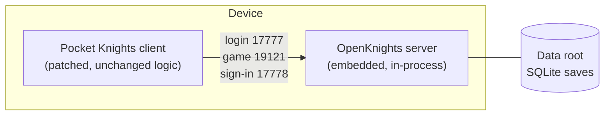

# OpenKnights Engineering Wiki

This wiki is the engineering record of OpenKnights. It explains, system by system, how Pocket Knights works on the inside, how each part of it was deciphered, and where the behavior is reproduced in this repository's code. It is written as a reference encyclopedia, not a tutorial. You are meant to look things up.

If you are here to play the game or to read about heroes, items, and events, that content lives on the separate player site, not here. This wiki is for people who want to understand or verify the reconstruction, and for anyone who wants to learn the method well enough to do the same for another game. That transferable method is written up in [[Reconstructing a Mobile Game Server]], with everything else here as its worked example.

## What This Wiki Covers

- Every game system, on its own page, describing how the system behaves, the opcodes that drive it, the data files it reads, the state it persists, and the code that reproduces it.
- Every network opcode, indexed and cross-linked to the system that uses it.
- Every game data file, described by meaning and by its relations to other files, not by its contents.
- The methods used to decipher the protocol, the data files, and the deterministic math, and the method used to prove the reproduction is exact.

## How to Read It

Pick your entry point:

| You want to | Start at |
| --- | --- |
| Find one system and understand it | [[System Index]] |
| Look up what an opcode does | [[Opcode Index]] |
| Understand a data file and its relations | [[Data File Index]] |
| Learn a term | [[Glossary]] |
| Understand how the game was reverse engineered | [[Method Capture]], [[Method Opcode Decoding]], [[Method CSV Decryption]] |
| Understand how correctness is proven | [[Method Differential Harness]] |
| Learn the transferable method, to apply it to another game | [[Reconstructing a Mobile Game Server]] |
| Understand the deliberate offline admin command policy | [[Admin Commands]] |

Every system, opcode, and data-file page follows the same fixed layout, so once you have read one, you can read all of them. Contributors adding a page copy the [[Page Template]].

## The Shape of the Project

OpenKnights reproduces the server that Pocket Knights talks to, then delivers that server to the player in two ways: on a PC for development, and embedded inside the patched app for fully offline play. The client is the player's own copy of the game, redirected to talk to the local server instead of the original online services.

The behavior of that server is pinned to the original game to the byte. How that is achieved and proven is the subject of the method pages.

## A Note on Scope and the Boundary

This wiki documents structure and behavior. It never reproduces the game's proprietary data, code, or art. The one page that defines this boundary is [[What Is Not In This Repository]], and every page that touches private material links to it. Read it first.
