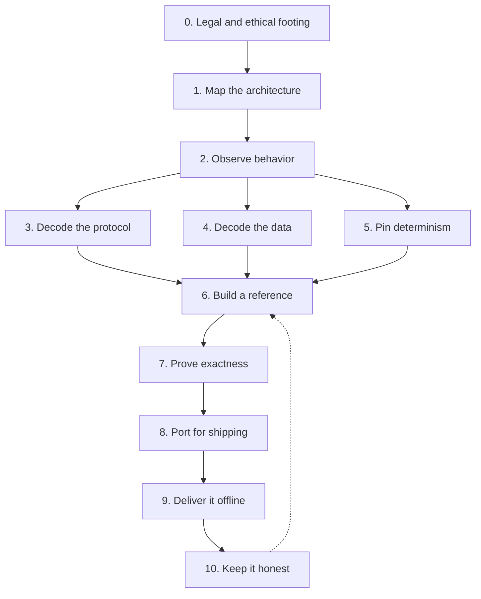

# Reconstructing a Mobile Game Server

**Definition.** The transferable method behind OpenKnights, written so it applies to any online mobile game whose server is gone. This is the field guide. The rest of the wiki is the worked example; this page is the method you could follow for a different game.

An online game's client is only half of the software. The other half, the server, holds the rules, the economy, the world, and the saves. When the server is retired, the client still runs but cannot function. Reconstruction rebuilds that missing half from the client's observable behavior, then delivers it back so the game plays again. This page lays out how, phase by phase. Each phase states the general principle first, then links to how OpenKnights did it.

## The shape of the work

The order matters. Observation feeds everything. A reference implementation is the authority the shipped code is measured against. Nothing is trusted until it is proven exact.

## Phase 0: Legal and ethical footing

Decide the boundary before writing a line. A preservation project documents behavior and reimplements the server in original code; it does not redistribute the game. Work from a copy the user already owns, never ship the publisher's code, data, or art, and never build something that lets a person play without owning the game. Understand that reverse engineering for interoperability and preservation sits on different footing than copying, and that the footing varies by jurisdiction. Write the boundary down and enforce it mechanically so it cannot be crossed by accident.

In OpenKnights: [[What Is Not In This Repository]] is the boundary, and the [[Tools and Toolchain|repository guard]] enforces it.

## Phase 1: Map the architecture

Learn the shape before the detail. How does the client reach its server: how many services, on what transports, on what ports? What is the server responsible for that the client cannot decide for itself: authentication, the economy, combat resolution, the shared world? The answers tell you what you are rebuilding and in what order.

In OpenKnights: three services (login, game, and sign-in) carry the whole game. See [[Opcode Index]] for the transports and [[Home]] for the architecture.

## Phase 2: Observe behavior

Everything downstream rests on observation. Set up a controlled environment where you can watch the client: an emulator or a device you control, capturing the traffic it sends and receives, the stored state before and after each action, and the clock and identity in force at the time. Perform one action, record what it produced, then vary it systematically to see which inputs move which outputs. The goal is never to replay a recording; it is to understand the rule well enough to regenerate the result from first principles.

In OpenKnights: [[Method Capture]].

## Phase 3: Decode the protocol

Recover the message layouts. Learn the framing, then for each message learn which bytes are which fields, in what types and order, by holding everything fixed but one input and watching the payload move. Account for the full set of replies a request produces, and decode the refusals as carefully as the successes: a faithful server rejects the same cases with the same message, not only succeeds in the same ones.

In OpenKnights: [[Method Opcode Decoding]] and the [[Opcode Index]].

## Phase 4: Decode the data

Most games ship their balance and content as packed data tables. Find where they live, learn how the client turns the packed form into rows it reads, and reproduce that transform so you can read the same rows from the user's own copy. Document what each table means and how it joins to the others; those joins are most of what a system is. Keep the decrypted contents private; publish the method and the structure, never the rows.

In OpenKnights: [[Method CSV Decryption]] and the [[Data File Index]].

## Phase 5: Pin determinism

Find every place the game's behavior depends on something that must be reproduced exactly: its random generator, its floating-point rounding, its use of the clock, and its generation of identifiers. A single wrong bit in a random draw or a rounded number sends a battle or a reward down a different path. Route randomness, time, and identity through single controlled sources so a scenario can be pinned and replayed deterministically. This is the precondition that makes exactness testable.

In OpenKnights: [[Method Determinism]], with the generator and float model quoted in full.

## Phase 6: Build a reference implementation

Turn the understanding into an authority. Write a reference server that reproduces the behavior, one system at a time, behavior-first. The reference does not have to ship or be fast; it has to be correct, because it becomes the source of truth the shipped code is measured against. Building it system by system, in the order the client exercises them, keeps the work tractable and the priorities clear.

In OpenKnights: the reference is private; its role is described in [[Method Differential Harness]].

## Phase 7: Prove exactness

Do not trust a reproduction that merely looks right. Replay recorded scenarios against both the reference and the code you intend to ship, and require every message, every state change, and every random draw to match byte for byte. When the reproduction cannot yet answer a message, charge the wait to the first system responsible, so a cascade is attributed to its root cause and you always know which system to build next. A system is done when it causes zero waits and every scenario still passes with zero differences.

In OpenKnights: [[Method Differential Harness]].

## Phase 8: Port for shipping

A reference tuned for correctness is often not what you want to ship. If the delivery target is the device, port the server to a language that runs there while preserving exactness to the bit: model the 32-bit float and the random generator identically, match the reference's number and text formatting exactly, and mind the target platform's constraints. Keep the reference as the authority and prove the port against it with the same harness.

In OpenKnights: the port is Kotlin, running on a PC and inside the app. The exactness primitives are in [[Tools and Toolchain|the exact module]].

## Phase 9: Deliver it offline

Give the reconstruction back to the player. Patch the client so that, instead of reaching the retired services, it talks to your server: redirect the sign-in and payment calls, leave the game's own logic untouched, and sign the result so the player can update it. To play with no server at all, embed the server inside the patched app and keep the saves as files the player controls. Add nothing the game did not already need.

In OpenKnights: [[The Patcher]], [[Accounts and Sign-in]], and [[Save and Data Root]].

## Phase 10: Keep it honest

Two disciplines keep the project trustworthy over time. First, a mechanical guard that refuses to let the publisher's content or private material enter the repository, so the boundary holds even under pressure. Second, documentation written as you go, system by system, so the knowledge is not trapped in one person's head. The wiki you are reading is that documentation.

In OpenKnights: the [[Tools and Toolchain|guard]] and this wiki.

## If you are applying this to another game

- Start at Phase 0 and do not skip it. The boundary is what makes the work defensible.
- Expect Phase 5 to be where correctness is won or lost. Budget for it.
- Build the reference before the shipped code, and never let the shipped code become its own authority.
- Document each system as you finish it, using the [[Page Template]]. A reconstruction no one can read is half a preservation.

## See Also

- The method pages, in order: [[Method Capture]], [[Method Opcode Decoding]], [[Method CSV Decryption]], [[Method Determinism]], [[Method Differential Harness]].
- [[What Is Not In This Repository]], the boundary that governs all of it.
