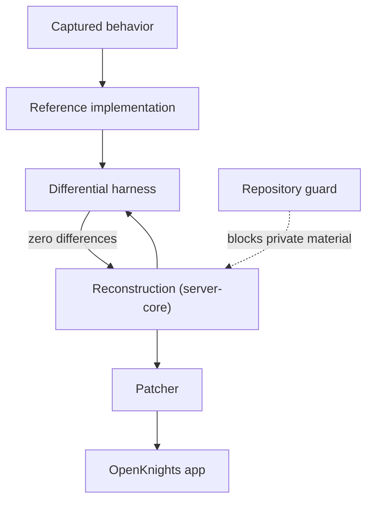

# Tools and Toolchain

**Definition.** The tools the project is built with: the ones written in-house to reconstruct and verify the game, and the external ones used to build and package the app. Each in-house tool has a job specific to the exactness discipline.

## In-house Tools

### The Differential Harness

The harness is how exactness is proven. It replays recorded scenarios against the reconstruction and compares every result against the reference. See [[Method Differential Harness]] for what it compares and why. It runs from a single command over a folder of bundles and writes a report:

```
gradlew :server-pc:runBundles
```

Each bundle prints its result as it runs, and a summary is written to `build/bundle-reports/report.json`:

```json
{ "profile": "openknights_bundle_report_v1", "all_passed": true, "bundles": [ ... ] }
```

Reproduced in `server-pc/.../harness/BundleRunner.kt` and `RecordingRunner.kt`.

### The Repository Guard

The guard keeps the boundary from being crossed by accident. It refuses to let game files, private material, or forbidden references enter the repository, and it runs as a commit hook and in the build. Its own header states its jobs:

```
python tools/guard.py --staged            check the files staged for commit (pre-commit hook)
python tools/guard.py --all               check every tracked file (CI)
python tools/guard.py --commit-msg FILE   check one commit message (commit-msg hook)
python tools/guard.py --commits RANGE     check a range of commit messages (CI)
```

It blocks game and binary file types, private folders, long tokens that could be secrets, and the references the project keeps out. A maintainer can also point it at a private marker file so specific literals are refused everywhere. Reproduced in `tools/guard.py`.

### The Exactness Primitives

Not a program but a library the whole reconstruction is built on: the `exact` module. It provides the deterministic building blocks that make byte-for-byte reproduction possible, each modeling a specific behavior of the original. See [[Method Determinism]]. Examples are quoted on [[Battle Engine]] and [[Method Determinism]], and it includes the pseudo-random generator, the 32-bit float model, exact rationals, and the number and text formatting that match the reference's output.

### The Patcher

The patcher is both a shipped tool and a development one: it produces the OpenKnights app, and during development it produces the on-device build tested on a device. See [[The Patcher]].

## External Tools

These are standard tools the project uses as-is.

| Tool | Used for |
| --- | --- |
| Gradle | Building every module and running the tests |
| d8 and L8 | Compiling the server to Android DEX with core-library desugaring |
| aapt2 | Inspecting and verifying the patched manifest and resources |
| apksigner | Signing the patched app with the player's key |
| adb | Installing and driving builds on a device or emulator during development |
| SQLite | The database engine behind every save, through a clean driver interface |

The Android build tools are part of the Android SDK. The server runs on a PC through a JDBC driver and on the device through the platform's own SQLite, behind one interface, so the same store code runs in both places. See [[Save and Data Root]].

## How the Tools Fit Together



## See Also

- [[Method Differential Harness]] and [[Method Determinism]].
- [[The Patcher]].
- [[What Is Not In This Repository]], which the guard enforces.
